# 📐 Wiki: Arquitectura 'Diamond Tier' — EquipCompare [v1.1.0]

Estructura técnica de la comparativa de equipo mantenida por **DarckRovert**.

## 🏗️ Jerarquía del Sistema Tooltip Hub (Gear Hierarchy)

**EquipCompare** opera mediante la intercepción del evento de muestra de información de objetos:

1.  **Tooltip Hook (`EquipCompare.lua`)**: Ganchos en `GameTooltip:SetHyperlink` y `GameTooltip:SetBagItem` para detectar qué objeto está viendo el usuario.
2.  **Slot Analyzer (`localization.lua`)**: Lógica que determina el slot de equipo del objeto (ej: "Peto", "Anillo") para buscar la pieza equipada correspondiente.
3.  **Secondary Frame (`EquipCompare.xml`)**: El contenedor visual `EquipCompareTooltip` que se posiciona automáticamente al lado del tooltip original.
4.  **Char-Sync (`CharactersViewer`)**: Módulo opcional para comparar con el equipo de otros personajes de la misma cuenta.

---

## 🧭 Diagrama de Flujo: Comparativa de BiS v9.4

```mermaid
graph TD
    A[Inicio: Hover sobre Ítem] --> B[Hook GameTooltip_OnShow]
    B --> C[Extracción de Slot de Hechizo/Ítem]
    C --> D{¿Pieza Equipada?}
    D -- Sí --> E[Búsqueda de Datos de ItemEquipped]
    E --> F[Carga de Tooltip Secundario Diamond Tier]
    F --> G[Alineación de Anclajes dinámicos]
    G --> H[Renderizado de Estadísticas Comparativas]
    D -- No --> I[Ocultar Frame Secundario]
    H --> J[Monitoreo de Cierre de Tooltip]
    J --> I
```

## ⚡ Estrategias de Ingeniería Diamond Tier

- **Smart Anchoring**: EquipCompare v9.4 calcula la posición de la pantalla para que el tooltip comparativo nunca se salga de los límites visibles, ajustando el anclaje a la izquierda o derecha según sea necesario.
- **Ring/Trinket Sequence**: Al comparar anillos o abalorios, EquipCompare puede ciclar entre ambos slots equipados para ofrecer una comparativa total de BiS.
- **Asynchronous Data Fetch**: La obtención de los datos del objeto equipado se realiza mediante punteros de memoria rápidos del cliente 1.12.1 para evitar latencia visual.

---
© 2026 **DarckRovert** — El Séquito del Terror.
*Ingeniería de equipo para la conquista de Azeroth.*

